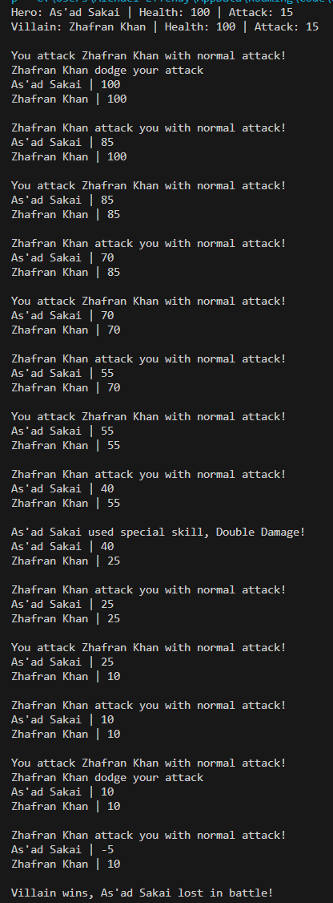

# Modul 2: Interface dan Abstract Class dalam OOP

## Deskripsi

Modul ini mengeksplorasi penggunaan **Interface** dan **Abstract Class** dalam pemrograman berorientasi objek (OOP) menggunakan Java. Proyek ini terdiri dari beberapa kelas yang saling berinteraksi untuk memodelkan karakter dalam permainan berbasis teks.

## Konsep Utama

Isi masing-masing bagian di bawah ini dengan penjelasan terkait konsep dan penerapan kode yang telah Anda buat.

### 1. Penggunaan Abstract Class

`abstract class Character` di sini menjadi class induk dari class `Hero` dan `Villain`. Seluruh atribut dan method dari class `Character` ini diwariskan ke class anak (kecuali yang modifiernya `private`). Sesuai namanya, karena abstract class, maka ada method yang bersifat abstract, atau dapat disebut sebagai method kosongan (tidak memiliki isi atau body). Method abstract, yaitu `showCharacter()` perlu didefinisikan isinya pada masing-masing class anak. Dalam kasus ini, di class `Hero`, method itu dioverride untuk menampilkan nama, health, dan attack dari suatu hero. Sementara itu, di class `Villain`, method itu dioverride untuk menampilkan nama, health, dan attack dari suatu villain. Abstract class ini diwarisi ke subclass dengan keyword `extends`.

### 2. Penggunaan Interface

Dalam kasus ini, interfacenya adalah `Behaviour`. Interface ini berisi method-method yang bersifat abstract semua, misalnya `spesialSkill(Character a, int random)` dan `dead(Character a)`. Alasan mengapa menggunakan parameter `Character a` adalah agar bisa digunakan untuk mempassing objek `Hero` ataupun `Villain` mengingat mereka adalah turunan dari `Character` sehingga kompatibel. Meskipun di code tidak ada keyword abstract pada methodnya, tetapi karena ini adalah interface, seluruh method yang ada di dalamnya sudah pasti bersifat abstract. Hal ini menyebabkan seluruh method yang ada di suatu interface wajib dioverride di class-class yang mengimplementasikannya dengan keyword `implements`.

### 3. Random integer generator dengan algoritma LCG (Linear Congruential Generator)

Saya membuat sebuah class baru bernama `Random` untuk membuat sebuah randomizer angka bilangan bulat. Randomizer ini dirancang dengan menggunakan algoritma LCG. Nilai seed awal didapatkan dari waktu system dalam milisecond. Seed tersebut dikalikan dengan 16807 kemudian dimodulo dengan 2^31 - 1 atau 2147483647. Seed dikalikan 16807 karena di beberapa penelitian sudah diuji sebagai multiplier terbaik (faktor primitif dari modulus 2147483647). Angka 2147483647 digunakan untuk mencegah overflow 32 bit.

### 4. Konsep Battle

Pada method `main` di class `Driver`, dapat dilihat bahwa battle berlangsung secara turn based atau bergantian, dimulai dari Hero duluan, dilanjutkan oleh Villain, kembali ke Hero, dan seterusnya. Battle akan berlangsung sampai salah satu antara Hero dan Villain kalah atau memiliki health 0 atau di bawah 0. 

### 5. Konsep Dodge Attack (Menghindari attack)

Setiap kali melakukan attack, ada 25% probabilitas bahwa attack tersebut missed atau berhasil dihindari oleh lawan. Probabilitas 25% tersebut didapatkan dengan cara mengambil angka random hasil generator LCG, kemudian dimodulo dengan 4 (hasil dari modulo 4 antara 0,1,2, atau 3). Jika bil%4 hasilnya 0, maka attack berhasil dihindari, jika selain 0, maka attack berhasil dilakukan dan health akan berkurang sejumlah attack.

### 6. Konsep Spesial Skill

Terdapat dua jenis spesialSkill, yaitu regeneration dan double damage. Hero atau Villain dapat menggunakan spesial Skill jika health yang dimiliki di bawah 50 dan belum pernah menggunakan spesial skill sebelumnya. Probabilitas dilakukannya spesial skill adalah 25%, didapatkan dengan angka random bil%4 bernilai 0 untuk mengaktifkan spesial skill dan sisanya attack biasa. Atribut `count` dilihat untuk memastikan bahwa sebelumnya pernah menggunakan spesial skill (`count` bernilai 1) atau tidak (`count` bernilai 0 ). Spesial skill yang didapatkan juga dirandom, yaitu bil%2==0 untuk regenerasi (jika hasilnya 0 maka regenerasi) dan yang lainnya (bil%2==1) untuk double damage, jadi murni 50% masing-masing probabilitasnya. Jika regeneration, tambahkan health dengan 30. Jika double damage, atur attack menjadi dua kali lipat (30), hitung lagi bil%4!=1, jika iya, maka attack tidak berhasil didodge, jika hasilnya bil%4 adalah 1, maka attack berhasil didodge (25% probabilitasnya).

---

## Gambar Hasil Run

Gambar di atas adalah hasil run pertama. Dapat dilihat bahwa battle antara hero dan villain berlangsung sampai salah satunya memiliki health 0 atau di bawah 0. Dapat dilihat bahwa ada attack yang bisa didodge dan ada spesialskill seperti regeneration dan double damage yang hanya bisa dilakukan 1x per hero atau villain.

Gambar di atas adalah hasil run kedua. Dapat dilihat bahwa hasil battle yang didapatkan berbeda, hal ini disebabkan oleh sistem randomisasi yang telah dibuat, menyebabkan dodge attack dan munculnya spesialskill menjadi random. Hal ini menandakan setiap kali program dirun, hasilnya akan berbeda-beda.

---
